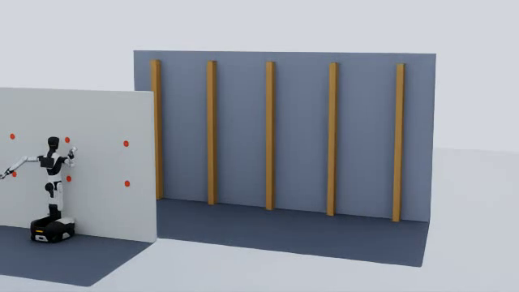
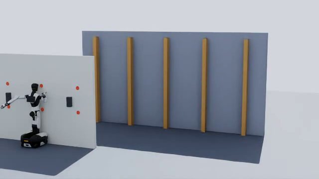
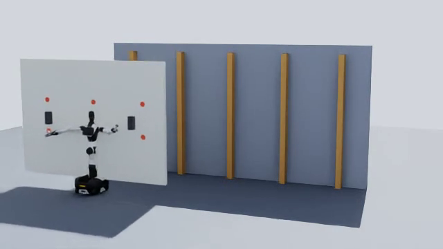
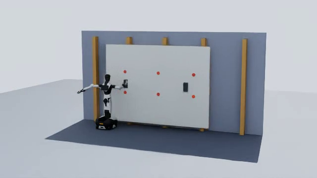
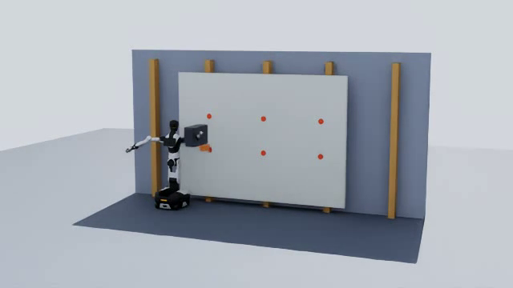
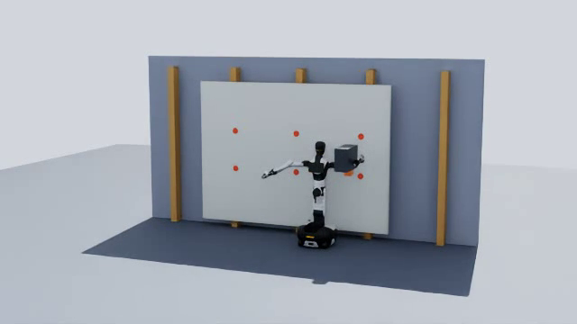

# 新西兰建筑行业智元机器人具身智能部署方案

## ——智元机器人"Yuansheng"计划(Deployment State Partner Incentive Policy)申请书投稿材料(含奥克兰交通局 AT 拓展场景)

---

## 文档说明

本材料在原《新西兰具身智能与通用机器人联合研发及产业化项目合作方案》基础上收窄改写,专门服务于向智元机器人"Yuansheng" Deployment State Partner Incentive Policy 的投稿申请。相较原稿,本材料做了以下三点调整:

1. **移除全部 MBIE(新西兰商业创新与就业部)及新西兰政府科研基金相关内容**。Yuansheng 计划本身即提供 NRE 阶段激励与规模化阶段"七项权益"两级商业化资助机制,本材料以该机制作为项目资金与里程碑框架,不再依赖新西兰政府科研基金申报路径。
2. **收窄并重新定义应用范围**:原稿覆盖制造、仓储物流、农业、医疗养老、实验室自动化、基础设施巡检、教育、公共服务、环境监测等九大泛行业场景。本材料聚焦两条主线——**新西兰建筑行业全流程关键工序**(地基浇筑、外水/管线工程、建筑框架搭建、内装与石膏板/内墙板装订、封顶与屋面防水、浴室防水工程、瓷砖铺贴等)与**奥克兰交通局(Auckland Transport, AT)**相关基建/站点场景(已有初步接触、拟推进目标),充分利用团队已完成的智元机器人石膏板搬运与连续装订仿真成果作为首发验证工序,并规划向其余工序的分阶段扩展路径。
3. **补充技术 Pipeline、国内外差异分析、新西兰建筑规范衔接(含 PS1–PS4 及 CCC 全流程合规证据链)**三部分内容,回应 Yuansheng 计划对技术可行性与合规可落地性的审核要求。

---

## 一、项目团队及主要成员

本项目团队采用"Lead 统筹执行 + 学术牵头人 + 智元新西兰项目团队 + 核心技术负责人 + 建筑行业合作伙伴"的五方协作架构:

> **马博博士(Lead)+ Wei Qi Yan(牵头人) + Louis(建筑行业合作伙伴,BBCNZL) + Hunter Shao / Rex Xu(智元机器人新西兰项目团队)+ 王思维 Siwei Wang(核心技术负责人)**

### 1. 项目负责人(Lead):马博博士 Dr Bo Ma

马博博士具有人工智能和计算机视觉博士研究背景,并拥有多年工业界人工智能产品研发、边缘计算和系统部署经验,担任本项目 Lead,统筹项目技术实施与投稿执行。

其主要技术方向包括:

- 计算机视觉和深度学习;
- 机器人视觉和具身智能;
- 视觉语言模型和多模态人工智能;
- 目标检测、目标跟踪和行为分析;
- 摄像头遮挡、篡改和环境变化检测;
- 隐私保护人工智能;
- 边缘设备 AI 模型优化;
- 嵌入式平台和资源受限设备部署;
- AI 算法从科研原型到工业产品的工程化。

马博博士具有完整的工业人工智能产品开发经验,工作覆盖:行业需求分析、数据集规划与建设、模型训练和算法开发、模型压缩与性能优化、边缘平台部署、系统接口和产品集成、现场测试和工程验证、误报/漏报及复杂失败案例分析、产品持续迭代和质量保障。

其技术经验尤其适合解决机器人在新西兰建筑工地真实环境中可能遇到的问题,包括:光照突然增强或减弱(室外/半室外工地过渡)、夜间和低照度巡检、摄像头被泥浆/粉尘/材料遮挡或污染、机器人移动引起的图像变化和抖动、工人/设备/材料之间的复杂遮挡、小目标(螺钉头、间距标记)和远距离目标识别、网络不稳定或偏远工地无法使用云端服务、敏感人员图像与商业信息的隐私保护、机器人决策不确定时的安全停止、传感器异常/视频中断/环境突变、人机协作中的安全风险识别。

在本项目中,马博博士将担任:项目 Lead 及 Yuansheng 投稿执行负责人;机器人 AI 系统架构负责人;具身智能和多模态人工智能算法负责人;计算机视觉和视觉语言模型负责人;智元机器人平台 AI 软件集成负责人;边缘部署和模型性能优化负责人;新西兰建筑与 AT 场景测试负责人;系统可靠性、数据质量和技术风险负责人;科研成果向商业产品转化的核心技术负责人。

### 2. 牵头人:Associate Professor Wei Qi Yan

新西兰工程院院士 / Fellow of Engineering New Zealand Te Ao Rangahau
奥克兰理工大学(AUT)副教授

Yan 院士现任奥克兰理工大学计算机与信息科学领域副教授,从事计算机视觉、机器人视觉、深度学习、智能视频分析、数字几何和人工智能系统研究,并参与领导 AUT 机器人与视觉方向的研究工作。Yan 院士长期承担科研项目组织、研究生培养、国际学术合作和人工智能工程教育工作,在连接高校科研、产业需求和国际技术资源方面具有丰富经验。

在本项目中,Yan 院士将担任:项目学术牵头人;首席研究员;项目总体战略和科研方向负责人;AUT 与智元机器人合作的主要学术负责人;机器人视觉、具身智能和深度学习研究负责人;博士生、硕士生及研究人员的主要学术导师;项目科研质量、研究方法和技术路线负责人;学术成果、论文和知识产权工作的总体负责人;AUT 校内科研资源和国际合作资源协调负责人;新西兰高校、科研机构及建筑行业合作伙伴的主要联系人。

Yan 院士将从项目战略、科研规划、人才培养和国际合作层面对项目进行总体领导,组织 AUT 科研团队和研究生参与项目,并推动科研成果转化为可以在新西兰建筑与交通基础设施真实场景中部署的机器人产品。

### 3. 智元机器人新西兰项目团队:Hunter Shao / Rex Xu

Hunter Shao 此前在华为工作,现负责智元机器人新西兰项目;Rex Xu 同样负责智元机器人新西兰项目。二人共同构成本项目对接智元机器人总部与新西兰本地市场的执行团队,主要职责包括:

- 智元机器人设备、SDK、API 及运动控制接口的获取与技术对接;
- 智元机器人总部与本项目团队之间的沟通协调;
- Yuansheng 计划投稿材料准备、里程碑申报(MS1/MS2/MS3)及规模化阶段权益的执行落地;
- 新西兰本地代理商体系、设备交付与售后支持的组织协调;
- 面向新西兰建筑行业客户与 AT 的产品展示、现场验证组织。

Hunter Shao 在华为的工程与产品化背景,有助于本项目在设备工程化落地、系统集成和产业化交付节奏方面与智元机器人总部高效对接。

### 4. 核心技术负责人:王思维 Siwei Wang

王思维担任本项目核心技术负责人之一,负责机器人平台技术路线、智元机器人软硬件接口协调、系统集成、应用场景设计和产品落地工作。

其主要职责包括:参与机器人产品总体架构设计;负责与智元机器人及代理商开展技术沟通;推动机器人本体、传感器、控制系统和 AI 软件集成;参与智元机器人 SDK、API 和运动控制接口评估;协调机器人平台测试、功能验证和问题解决;参与新西兰建筑行业需求分析和应用场景设计;协助建设机器人演示、测试和应用环境;参与行业客户沟通、产品展示和现场验证;推动技术成果形成商业产品和行业解决方案;配合 Lead 与牵头人开展产业合作、设备资源和项目资源协调。

王思维将重点连接智元机器人平台能力、本地代理商资源和新西兰建筑行业需求,确保科研工作能够与机器人产品能力和市场实际需求有效结合。

### 5. 建筑行业合作伙伴:Louis(BBCNZL)

Louis 就职于新西兰建筑公司 BBCNZL,是本项目在新西兰建筑行业一侧的合作伙伴,主要职责包括:

- 提供真实建筑工地场景准入与施工工艺现场知识;
- 提供新西兰建筑规范、Producer Statement(PS1–PS4)流程和 Licensed Building Practitioner(LBP)签署制度方面的实务经验;
- 协助确定首个示范场景(内墙板/石膏板装订)的任务边界与验收标准;
- 协调示范工地的现场测试、安全管理和客户反馈收集;
- 作为新西兰建筑行业终端用户,验证机器人产品的实际经济价值和可推广性。

Louis 的加入使项目在"机器人技术是否符合新西兰建筑现场实际工艺和规范要求"这一关键问题上,拥有一线施工方视角的直接检验,避免方案停留在实验室假设层面。

### 团队互补优势

本项目形成"Lead 统筹执行 + 学术牵头与科研质量 + 智元总部资源对接 + 机器人平台核心技术 + 建筑行业一线验证"的五方互补结构:

- **马博博士(Lead)**主要负责:项目整体技术架构与 Yuansheng 投稿执行;AI 感知、安全决策与边缘部署核心算法;系统工程和产品化实现;新西兰建筑与 AT 场景现场测试和技术迭代。
- **Yan 院士(牵头人)**主要负责:项目总体战略;科研方向和学术质量;AUT 高校资源协调;博士、硕士及研究人员培养;国际学术合作;科研成果和知识产权总体规划。
- **Louis(BBCNZL,建筑行业合作伙伴)**主要负责:建筑工艺与新西兰建筑规范/PS3 合规实务;示范工地准入与现场协调;客户需求与经济价值验证。
- **Hunter Shao / Rex Xu(智元新西兰项目团队)**主要负责:智元机器人及代理商技术协调;Yuansheng 计划里程碑申报与规模化权益执行;设备、平台和工程资源组织;产品展示、行业验证和商业化协同。
- **王思维(核心技术负责人)**主要负责:机器人平台接口和系统集成;产品需求和行业场景衔接;设备、平台和工程资源组织;应用场景设计与落地。

五方共同构成从技术研发、平台对接、行业验证到 Yuansheng 商业化里程碑申报的完整能力链条。

---

## 二、项目定位与聚焦范围说明

本项目以智元机器人通用机器人平台为基础,针对**新西兰建筑行业全流程中标准化、可量化、可复用的关键工序**——地基浇筑、外水(给排水/管线)工程、建筑框架搭建、内装与内墙板装订、封顶与屋面防水、浴室防水工程、瓷砖铺贴等——以及**奥克兰交通局(AT)相关基础设施场景**,研发一套具有新西兰本地验证数据和实践经验的机器人应用方案。

项目不是对现有机器人的简单采购、销售、演示或功能配置,而是通过智元机器人的机器人本体、传感器、运动控制和软件平台,与团队已完成的石膏板搬运与连续装订仿真成果,以及 Yan 院士团队的人工智能科研和工程能力相结合,形成能够在新西兰真实建筑与交通基础设施现场运行的机器人产品与解决方案。

项目重点解决以下问题:

1. 机器人如何理解真实建筑工地在不同工序阶段的工作环境(基础/钢筋、管线沟槽、框架/龙骨、板材、屋面、防水层、瓷砖、脚手架、警示标识等);
2. 机器人如何识别工人、材料、设备和工作状态,并在复杂、变化的工地环境中稳定工作;
3. 机器人如何理解现场监理/工头的自然语言及多模态任务指令;
4. 机器人如何在不确定情况下安全停止或寻求人工确认,符合新西兰工作场所健康与安全法(HSWA 2015)对人机协作的要求;
5. 机器人如何保护工人身份、施工现场影像等商业信息和敏感数据,符合新西兰《隐私法 2020》;
6. 机器人在各工序中执行的任务(浇筑记录、管线核查、框架固定、装订间距、防水层覆盖、瓷砖平整度等)如何与新西兰建筑规范和验收流程——PS1(设计)、PS2(设计复核)、PS3(施工证明)、PS4(施工监督证明)以及最终的 Code Compliance Certificate(CCC,建筑合规证书)——对接,形成分工序、可追溯的过程证据;
7. 如何将实验室与仿真环境中已验证的石膏板装订科研成果,作为首发工序转化为可在新西兰分散、中小规模工地中可销售、可维护、可规模化部署的产品,并以此为基础规划向其余工序的技术复用与扩展路径;
8. 如何以此为起点,逐步扩展到奥克兰交通局相关的车站、换乘枢纽等基建场景。

项目将重点开发智元机器人硬件平台之上的"**建筑全流程场景智能感知、工序任务执行、安全保障与分工序合规证据生成层**"。相关软件和算法将尽量采用模块化、可配置和跨平台设计,使其未来不仅可以适用于智元机器人的不同产品型号,也可以扩展至其他轮式机器人、机械臂、移动操作机器人和建筑行业专用设备。

本项目与 Yuansheng 计划"Task Deployment Mode"高度契合:内墙板装订、瓷砖铺贴、框架固定核查等均是典型的任务导向型(task-oriented)工业/建筑现场应用,与工业制造、仓储物流场景在"结构化任务 + 可量化验收标准"这一维度上具有相似性,便于按 Yuansheng 计划的场景难度系数体系进行申报评估;由于地基浇筑、外水工程、封顶防水、浴室防水等工序均不在现有七大场景清单内,项目将逐一配合智元机器人组织专家团队评估其难度系数,首发工序(内墙板装订)优先申报,其余工序按第三节所述路线图依次申报。

---

## 三、新西兰建筑全流程机器人应用场景

新西兰一个典型建筑项目从立项到交付,大致经历地基浇筑、外水(给排水/管线)工程、建筑框架搭建、内装(含内墙板装订)、封顶与屋面防水、浴室防水工程、瓷砖铺贴等关键工序,每道工序都对应新西兰建筑合规体系中不同类型的 Producer Statement(PS1–PS4),最终由 Building Consent Authority(通常是市议会)汇总审核后签发 Code Compliance Certificate(CCC)。本项目的目标,是让智元机器人在这些工序中逐步承担可量化、可复用的任务执行与过程证据生成角色。

### 场景总览

| 工序 | 机器人可承担的任务 | 主要对应合规环节 | 当前技术成熟度 |
| --- | --- | --- | --- |
| 地基浇筑(Foundation) | 钢筋绑扎间距核查、模板对齐检查、混凝土浇筑辅助与振捣监测、养护过程记录 | PS4(工程师施工监督证明)+ 议会现场检查 | 规划中 |
| 外水工程(Site Services,给排水/管线) | 管沟开挖定位辅助、管线铺设间距/坡度核查、连接点影像记录 | PS3 + 议会管线检查 | 规划中 |
| 建筑框架搭建(Framing) | 框架/龙骨搭建定位辅助、连接件与抗震支撑(bracing)固定质量核查、垂直度/平整度检测 | PS3(复杂结构构件可能需 PS4) | 规划中(与内装装订技术路径高度相关) |
| 内装与内墙板装订(Interior Fit-out / GIB®) | 板材搬运、贴墙、按标准间距完成多点位固定,过程数据结构化记录 | PS3 | **已通过仿真验证**(团队现有闭环) |
| 封顶与屋面防水(Roof Enclosure / Weathertightness) | 屋面材料铺设辅助、防水层搭接与节点(flashing)细部影像检查 | PS3(高风险项目可能另需第三方检查或 PS4) | 规划中 |
| 浴室防水工程(Wet Area Waterproofing) | 防水膜厚度与覆盖一致性核查、搭接/收口细部记录、淋水测试前自检 | PS3(通常由持证防水工出具) | 规划中 |
| 瓷砖铺贴(Tiling) | 铺贴间距/平整度/空鼓检测、瓷砖搬运定位辅助、勾缝一致性核查 | 内部质量验收,间接支持 CCC 申请材料 | 规划中 |

### 3.1 已验证工序:内装与内墙板(石膏板/GIB®)装订

新西兰建筑行业以轻型木框架和轻型钢框架建筑为主(住宅、公寓、商业与公共建筑内隔墙),内墙板装订是几乎每个建筑项目都会重复出现的高频、标准化、劳动密集型工序,同时也是与结构抗震支撑体系(bracing)直接相关、对固定间距和工艺一致性要求较高的工序,是机器人切入新西兰建筑行业的理想首发场景。

项目团队已在仿真环境中完成人形机器人石膏板搬运与连续装订的可复现闭环验证,覆盖以下环节:

- 机器人从起始位置走到板材前,双臂协同抓取、抬升、搬运板材至墙体/龙骨位置;
- 板材贴墙定位与释放,机器人换持固定工具(气动钉枪/螺钉枪);
- 按左、中、右三列,依次完成每列上、下两个固定点的装订,并按标准动作序列完成 press/hold;
- 全程记录墙体与龙骨的碰撞几何、固定点轨迹、接触力与工具压力、已安装固定件位置和阶段状态。

#### 仿真截图证据(智元 Genie G2,Isaac Sim)

以下截图取自团队已完成的智元 Genie G2 石膏板搬运与连续装订仿真录像(30 fps,总时长 26.67 秒,800 帧),证明相关流程已在智元官方机器人平台(Genie G2,`G2_omnipicker` 本体)与 Isaac Sim 环境中完成仿真验证,而非纯概念性描述:

| 阶段 | 截图 | 时间区间 |
| --- | --- | --- |
| 行走至石膏板前 |  | 0–2.0s |
| 双臂抓取石膏板 |  | 3.5–5.0s |
| 搬运石膏板至墙体/龙骨位置 |  | 6.5–8.8s |
| 石膏板贴墙定位 |  | 8.8–10.0s |
| 换持气动钉枪,完成左列下方固定点(第 1 点) |  | 11.5–14.0s |
| 完成右列上方固定点(第 6 点,收尾) |  | 24.0–26.5s |

完整视频、逐帧轨迹数据和运行参数记录均已在团队内部保存,可在尽调阶段向智元机器人提供完整证据包。

这一仿真闭环采用设计文档规定的确定性事件/运动模型,尚未宣称达到真实刚性夹爪或材料破坏级别的物理保真度,但已经验证了"任务分解—双臂操作—多点位精确固定—过程数据记录"这一完整流程在机器人平台上的可行性,是本项目区别于纯概念性提案的关键技术基础,也是后续其他工序技术路径可以直接复用的能力底座。

需重点验证的能力:机器人视觉识别精度(板材边缘、龙骨/骨架位置、固定点标记);装订间距与固定力度的一致性和可追溯记录能力;长时间运行稳定性与人机协作安全性;任务完成效率与新西兰本地人工作业方式的对比;与新西兰建筑公司现有施工流程(排期、监理签核、材料交接)的集成能力。

### 3.2 规划扩展工序

- **建筑框架搭建(Framing)**:与内装装订共享"结构定位识别 + 多点位精确固定 + 力度/间距过程记录"的核心技术路径,是内装装订之后技术复用度最高、优先级最高的扩展工序;
- **浴室防水工程 / 瓷砖铺贴**:同属内装范畴的低结构风险、高重复性任务,防水膜覆盖检测和瓷砖平整度检测可复用装订任务的视觉感知与质量核查能力,新西兰住宅投诉与漏水风险高度集中于此,机器人生成的量化检测记录商业价值突出;
- **封顶与屋面防水(Weathertightness)**:鉴于新西兰"漏水房"(leaky building)历史危机对屋面节点/搭接细部的高度敏感性,该工序的机器人介入需要更高精度的节点检测能力和更审慎的合规验证,列为中期扩展方向;
- **外水工程(给排水/管线)**:涉及室外沟槽作业和地下管线,场地环境和安全边界与内装工序差异较大,列为中期扩展方向;
- **地基浇筑(Foundation)**:属于结构安全关键环节,通常需要工程师出具 PS4 施工监督证明书,机器人在此阶段的角色应严格限定为过程记录与辅助监测(钢筋间距影像、浇筑记录),而非独立执行结构性作业,须在前述工序充分验证、且与结构工程师明确职责边界后,才纳入部署范围,列为长期审慎扩展方向。

扩展顺序遵循"技术复用度与安全风险"而非单纯的施工时序:优先规模化内装类低结构风险、高重复性任务(装订、瓷砖铺贴、浴室防水检测),中期扩展框架搭建辅助与外水工程管线核查,长期在与持证工程师明确职责边界后审慎评估地基浇筑等结构安全关键环节的机器人辅助角色。

---

## 四、聚焦场景二:奥克兰交通局(Auckland Transport, AT)相关基建与站点场景

### 背景

奥克兰交通局(AT)负责奥克兰地区道路、公共交通设施(公交、轻轨/电车、渡轮相关陆上设施)以及车站、换乘枢纽、控制中心等基础设施的建设与运维,通常通过主承包商/联盟(Alliance)交付模式实施资本性工程项目。这类项目在室内隔墙装订、设施巡检、夜间/低峰期站内管理等环节,与建筑行业场景存在显著的技术复用空间。

### 当前合作状态

项目团队已与 AT 建立初步接触,本材料所述内容为**进一步推进合作的立项与拟推进目标**,尚非正式签约合作,后续将按 Yuansheng 计划 MS1(立项通过)节奏,与 AT 及其承包方共同确定首个可执行的示范场景。

### 潜在应用方向

- **车站/换乘枢纽室内隔墙装订**:直接复用场景一已验证的板材搬运与装订能力,应用于新建或改造中的车站、控制室、办公及配套用房内隔墙施工;
- **基础设施巡检**:结构件、信号设备、标识、通道状态的视觉巡检与异常识别,反馈至 AT 的资产管理体系;
- **非高峰时段站内自主巡查**:利用客流较低时段完成常规状态巡检与基础维护性记录,减少对乘客与运营的干扰;
- **施工与维护证据采集**:为 AT 及其承包商在工程验收、缺陷责任期(defects liability period)管理中提供影像与传感器证据支持。

以上方向优先级将根据与 AT 及其承包商的进一步沟通结果确定,首个示范项目预计从"车站室内隔墙装订"或"设施巡检"中选择一项,以复用团队已有技术基础、降低启动风险。

---

## 五、核心技术研发(建筑与 AT 场景导向)

### 1. 鲁棒机器人视觉感知(建筑工地场景)

项目将研发适用于新西兰建筑工地与交通基础设施现场的机器人视觉系统,使机器人能够识别:工人及其活动、个人防护装备(PPE)状态;工具、板材、龙骨/钢架、脚手架等施工材料与设备;固定点、装订间距标记;危险区域、临时障碍物和异常情况;设备仪表、标识、文字和操作状态;地面、通道、门窗和工作区域状态。

系统将重点解决:工地强光/阴影剧烈变化;室内外环境切换;夜间和低照度巡检场景;相机运动和机器人行走引起的画面变化;粉尘、雨滴、泥浆等镜头污染;工人、设备与材料间的复杂相互遮挡;小目标(螺钉、固定件)和远距离目标识别;场景变化导致的模型性能下降。

遮挡、光线变化、相机运动和疑似篡改的视频,将作为算法鲁棒性测试案例,而不应被简单地全部判定为设备篡改事件。

### 2. 视觉语言模型与多模态交互

项目将在机器人视觉感知基础上引入视觉语言模型和多模态人工智能,使机器人能够理解现场监理/工头的自然语言指令、结合图像和语言理解任务、回答与现场环境相关的问题、识别并描述异常情况、根据操作手册辅助完成任务、在任务信息不足时主动询问、将复杂任务分解为多个操作步骤、理解人员手势与语音提示、生成检查与装订完成报告。

### 3. 机器人安全决策与可信人工智能

项目将研发机器人不确定性评估、安全停止、风险控制和人工确认机制。当机器人遇到目标识别置信度不足、工作区域突然出现人员、任务指令存在歧义、传感器数据相互矛盾、环境与训练数据存在明显差异、无法确认物体是否可以抓取、当前动作可能造成人身或设备风险、网络中断或关键服务不可用、运动路径被临时障碍物阻挡、设备状态与预期状态不一致等情况时,不应盲目执行动作,而应根据风险程度选择暂停操作、降低运动速度、重新观察和判断、请求人工确认、切换至安全模式、返回安全位置、终止当前任务、记录事件并生成报告。

该机制的设计将对齐新西兰《工作场所健康与安全法 2015》(HSWA 2015)对人机协作现场的安全监管要求。

### 4. 隐私保护与本地化 AI 处理

针对建筑工地及交通基础设施现场,项目将研究端侧图像和视频处理、人脸及人员身份信息保护、敏感区域自动模糊、数据最小化采集、非必要视频不上传云端、本地事件摘要生成、操作日志和 AI 决策审计、不同用户的数据访问权限、数据生命周期和删除机制,确保系统设计符合新西兰《隐私法 2020》及数据管理要求。

对于不需要保存原始视频的应用,系统可以只输出:是否发现异常、异常类型、异常发生时间、相关区域、置信度、必要的匿名化证据、后续建议,以降低机器人部署中的隐私风险、网络成本和数据安全风险。

### 5. 机器人异常与防篡改能力

项目将研发针对机器人传感器、摄像头和视觉系统的异常检测能力,包括摄像头被遮挡或人为覆盖、镜头污染、机器人位置发生异常变化、相机方向被改变、传感器失效、画面冻结、视频输入中断、光源异常变化、网络或数据流异常、系统受到误操作或人为干扰、机器人工作环境与预期环境不一致。相关技术可以用于机器人自检、设备维护、安全监控、远程诊断和故障预警,系统需区分真实篡改事件与正常光照变化、机器人主动运动、环境中短暂遮挡、镜头污染、网络或传感器故障,这种区分能力是降低误报、提高系统可靠性和建立客户信任的关键。

### 6. 端侧 AI 和边缘机器人计算

新西兰不少建筑与基建现场网络条件有限,项目将研究如何在机器人本地计算平台上部署人工智能模型,以降低对云端服务的依赖,主要研究内容包括模型压缩和量化、推理速度优化、计算资源和功耗控制、多个视觉模型之间的任务调度、视频处理帧率和精度平衡、本地视觉语言模型部署、网络中断情况下的离线运行、云端与边缘协同计算、机器人本体不同计算单元之间的任务分配。边缘部署可以提高机器人系统的响应速度、隐私保护能力和现场运行可靠性。

### 7. 机器人平台与行业应用中间层

项目将开发连接机器人本体和建筑/基建行业应用的软件中间层,包括机器人传感器接口、摄像头和视觉数据接口、任务管理接口、机器人状态管理、AI 模型管理、行业应用插件、异常和安全事件接口、远程监控和升级接口、数据记录和分析接口、权限和安全管理接口。通过该中间层,同一套核心 AI 能力可以根据建筑行业和 AT 基建场景的不同需求配置为对应的解决方案。

### 8. 多工序施工能力与新西兰建筑全流程合规证据链集成(PS1–PS4 / CCC,新增)

在上述通用能力基础上,项目将围绕建筑全流程各工序,重点扩展**分工序合规证据生成能力**:将装订间距/固定力度、框架连接件固定质量、防水层覆盖与搭接、瓷砖平整度、管线间距与坡度、钢筋间距与浇筑记录等过程数据,与对应工序的新西兰建筑规范可量化参数进行实时比对与结构化记录,形成按工序区分、可追溯的施工过程证据链,并与第八节所述的 PS1–PS4 / CCC 体系逐工序对应。

需要明确的是:该证据链**用于辅助**承包商、持证建筑从业人员(Licensed Building Practitioner, LBP)和监督工程师出具相应的 Producer Statement(PS2/PS3/PS4),并作为提交 Code Compliance Certificate(CCC)申请材料的辅助证据,机器人系统本身不具备、也不寻求替代任何法定签署资质——所有合规判断和最终签署仍由具备资质的人员完成,机器人提供的是执行一致性数据和可审计记录,降低人工核验成本、提高证据完整性,尤其在地基浇筑、封顶防水等结构安全或历史风险敏感工序中,机器人证据链的角色始终是"辅助监督"而非"替代签署"。

---

## 六、技术 Pipeline:数据采集 → 模型优化 → 机器人测试

### 阶段一:数据采集

- **仿真数据**:在现有石膏板搬运与装订仿真基础上,按第三节的工序路线图依次扩展场景参数(框架连接件规格、防水膜搭接规则、瓷砖模数、管线间距/坡度、钢筋间距等新西兰建筑标准参数),生成覆盖不同光照、遮挡、干扰条件的合成训练数据,并逐步提升抓取与接触力学的物理保真度;
- **现场数据**:在 BBCNZL 及后续 AT 相关示范工地,依据受控试点协议采集视觉、力/力矩、机器人关节状态等多模态数据,严格遵循工人知情同意与《隐私法 2020》要求,对人员面部等敏感信息做本地脱敏处理;
- **数据标注与治理**:建立统一的数据标注标准、版本管理和数据溯源机制,确保用于合规证据链的数据具备可审计的采集链条。

### 阶段二:模型优化

- **感知模型微调**:针对建筑工地特有的目标(板材、龙骨、固定点、工具、PPE)和干扰模式(粉尘、泥浆、强光)进行专项微调;
- **多模态指令理解优化**:结合新西兰工地常用术语与监理沟通习惯,优化视觉语言模型的指令理解与任务分解能力;
- **边缘部署优化**:针对部分工地网络条件有限的现实,进行模型压缩、量化与推理加速,支持离线/弱网环境下的稳定运行;
- **安全决策策略调优**:结合 HSWA 2015 人机协作安全要求,调整不确定性评估与安全停止的触发阈值;
- **仿真到现实的迁移**:以既有 Isaac Sim 装订仿真作为源域,以试点现场数据作为目标域,持续缩小仿真与真实工地环境之间的差距。

### 阶段三:机器人测试

采用分阶段、可回退的验证流程,与 Yuansheng 计划的里程碑体系对齐:

1. **仿真回归测试**:验证功能正确性、装订间距/固定力是否满足参数规范;
2. **受控环境测试**:在非生产环境中验证重复性和固定点精度是否稳定符合建筑标准;
3. **现场概念验证(对应 MS2/POC)**:在 BBCNZL 示范工地开展有限任务范围的现场测试,现场配备安全监督人员;
4. **规模化现场试验(对应规模化阶段)**:在 POC 通过验证后,逐步扩展至更多新西兰建筑工地及 AT 相关场景,现场数据持续回流至数据采集环节,形成闭环迭代。

---

## 七、国内建筑机器人应用与新西兰本地化差异分析

中国建筑行业机器人的应用经验不能直接照搬至新西兰市场,两地在建筑体系、监管文化和市场结构上存在明显差异:

### 国内建筑行业机器人应用特点

- 以大规模标准化、装配式混凝土/钢结构高层建筑为主,工地集中、体量大;
- 通常由总承包商主导部署决策,可自上而下推动机器人在单一工地的规模化使用;
- 劳动力成本上升与住建部"智能建造"试点政策共同驱动机器人应用;
- 施工规范体系以国家标准(GB 系列)为主,规范更新和地方标准衔接相对统一。

### 新西兰建筑行业特点

- 以轻型木框架和轻型钢框架低层建筑(住宅、公寓、小型商业建筑)为主,极少超高层密集工地;
- 行业高度分散,以中小型建筑公司和分包体系为主,单个工地规模远小于国内典型工地;
- 强合规驱动:《建筑法 2004》(Building Act 2004)及性能化的新西兰建筑规范(Building Code)、Producer Statement(PS1–PS4)体系、Licensed Building Practitioner 签署制度,是施工验收的核心机制;
- 石膏板/内墙板装订与抗震支撑系统(bracing)深度绑定,固定间距、固定件规格需符合厂商(如 GIB®)经 BRANZ 认证的系统要求,对一致性和可追溯性要求高;
- 劳动力短缺与人工成本高企,是推动机器人应用的核心经济动因,但同时工地分散、单场地规模小,不利于国内式"集中大规模部署摊薄成本"的经济模型;
- 更严格的人机协作安全监管(WorkSafe NZ,《工作场所健康与安全法 2015》);
- 历史上的"漏水房"(leaky building)危机,使新西兰建筑行业和监管方对新工艺、新材料、新工法的采纳更为审慎,任何机器人施工工艺都需要经过充分的合规验证才能被现场接受。

### 差异对项目策略的影响

基于以上差异,本项目不采用国内"集中大规模部署替代人力"的模式,而是采用:

- **移动/可调度部署模式**,适应新西兰分散的中小型工地结构,而非固定于单一大型工地;
- **聚焦高价值、精细化、合规敏感任务**(如装订间距与固定力度的一致性、可追溯记录),而非追求大范围劳动力替代;
- **与 LBP、Producer Statement 流程深度绑定**,机器人角色定位为"技能增强与合规证据保障工具",而非独立施工决策主体;
- **以 BBCNZL 等本地建筑公司为一线验证伙伴**,确保工艺方案先经过持证从业人员和一线工地检验,再逐步扩大部署范围。

---

## 八、新西兰建筑规范如何融入智元机器人现场施工规范

为使机器人现场施工行为真正符合新西兰建筑合规要求,项目将建立"规范参数化 + 人员背书"的双重机制:

### 1. 规范来源

- 新西兰建筑规范(New Zealand Building Code)相关性能条款,以及各工序对应的产品系统认证要求(如内墙板装订遵循的 GIB® Site & Systems Guide 固定间距/边距规则及其 BRANZ 认证;浴室防水遵循的 E3/AS1 等性能条款);
- Licensed Building Practitioner(LBP)制度与 Producer Statement 体系;
- WorkSafe NZ 《工作场所健康与安全法 2015》(HSWA 2015)对人机协作现场的安全要求;
- 《隐私法 2020》对现场影像与人员数据处理的要求。

### 2. Producer Statement(PS1–PS4)与 Code Compliance Certificate(CCC)体系

新西兰建筑合规体系围绕以下文件展开,项目将按工序分别对接:

- **PS1(设计证明书)**:由设计人员在建筑许可(building consent)申请阶段出具,证明设计符合建筑规范,与机器人现场施工环节关联度较低;
- **PS2(设计复核证明书)**:由具备资质的第三方对复杂或高风险设计要素(如结构、防水节点设计)进行独立复核后出具;
- **PS3(施工证明书)**:由承包商出具,证明施工按批准的设计和建筑许可完成,是内装装订、框架搭建、外水工程、封顶防水、浴室防水等大多数工序机器人过程数据的**主要对接对象**;
- **PS4(施工监督证明书)**:通常由工程师在地基、结构框架等关键结构/岩土工程施工过程中进行监督检查后出具,是地基浇筑等结构安全关键工序的对接对象;
- **CCC(建筑合规证书)**:由 Building Consent Authority(通常是市议会)在完成所有必要现场检查、收齐相应 PS1–PS4 文件后签发,是建筑工程完工的最终合规确认文件。

机器人在各工序生成的结构化过程证据(第五节第 8 条),按上表工序—证明书对应关系,分别辅助承包商、LBP 或工程师出具 PS3/PS4,并可汇总为标准化证据包,辅助最终提交 Building Consent Authority 的 CCC 申请材料;最终签署与审批决定权始终在具备法定资质的人员和 Building Consent Authority 手中。

### 3. 落地方式

- 将各工序规范中可量化的参数(固定件间距/边距、龙骨间距、防水膜搭接宽度、瓷砖平整度公差、管线坡度、钢筋间距、固定力矩/工具压力允许范围等)转化为机器人任务规划与执行层的参数化约束,由系统在作业过程中实时校验;
- 校验规则库的建立与更新,由建筑行业合作伙伴(Louis/BBCNZL)及持证建筑从业人员共同审核确认,确保参数来源可追溯、随规范更新可维护;
- 机器人系统仅承担"按已审核参数执行 + 生成过程证据"的角色,任何合规判断与法定签署仍由具备资质的人员完成,避免机器人系统被误解为替代法定合规程序,尤其在需要 PS4 工程师监督签署的结构安全关键工序中,机器人角色严格限定为辅助记录;
- 对于 AT 相关基建场景,将比照相应工程规范与验收流程,建立对应的参数化校验规则,与建筑场景形成统一的合规证据框架,便于后续跨场景复用。

---

## 九、与 Yuansheng 计划的对接与合作模式

本项目合作路径直接对齐 Yuansheng 计划的 NRE 阶段激励与规模化阶段"七项权益"机制,不再依赖新西兰政府科研基金申报路径:

### 立项通过(MS1)

由智元机器人或代理商提供适合的机器人平台,团队完成硬件和 SDK 评估、摄像头/传感器接口分析、视觉模型部署测试、机器人控制接口测试、装订任务安全机制初步设计、一至两个基础应用演示,以及技术可行性和风险评估报告;Louis/BBCNZL 确定首个示范工地及任务边界;Hunter Shao / Rex Xu 负责向智元机器人总部完成立项材料提交。

### POC 验证(MS2)

在 BBCNZL 示范工地(及视合作进展纳入的 AT 相关场景)开展现场需求分析、工作流程和任务分析、场景数据采集、算法适配、机器人功能开发、小规模现场测试、安全和隐私评估、客户反馈收集,以及经济价值和商业模式验证。每一项 POC 均将明确当前行业问题、机器人拟解决的具体任务、项目成功指标、安全边界、数据要求、客户投入、产品化路径和预期经济与社会收益。

### NRE 评分(MS3)

按智元机器人 NRE 评分标准提交技术方案与验证数据,评分将结合各工序场景的难度系数认定结果分别计算相应 NRE 激励额度。

### 规模化阶段(七项权益)

当项目在内装装订场景的累计采购订单达到 Yuansheng 计划规定的门槛后,推进标杆案例申请纳入官方"Select Solutions"案例库、通过 Design-in 机制共同定义装订场景的官方推荐解决方案、评估共建联合创新中心的可行性、申请技术快速通道支持、按规则申请市场推广补贴(MDF)与销量返点,并将合作范围逐步扩展至新西兰其他建筑公司以及 AT 相关基建场景,形成可复制、可规模化的区域解决方案。

### 后续工序的滚动申报

第三节所述的规划扩展工序(框架搭建、浴室防水、瓷砖铺贴、封顶防水、外水工程、地基浇筑)将在内装装订场景完成 MS1–MS3 并进入规模化阶段后,依次按同一 MS1→MS2→MS3 流程独立申报,每一工序均需单独完成智元机器人的场景难度系数评估,不与已验证工序合并计分,以保证每一新工序的技术可行性与合规可落地性均经过独立验证。

---

## 十、项目对各合作方的价值

### 对智元机器人的价值

- 进入新西兰建筑与交通基础设施细分市场,获得 AUT 学术团队与本地建筑行业双重背书;
- 建立以石膏板装订为代表的、可复用于其他国家轻型建筑市场的标准化任务解决方案;
- 通过 Yuansheng 计划的里程碑机制,以较低风险验证新西兰市场的产品适配能力;
- 建立面向 AT 及其承包商的基建场景示范案例,为进一步拓展公共部门市场奠定基础。

### 对智元机器人新西兰项目团队(Hunter Shao / Rex Xu)的价值

- 从设备推广升级为具备学术研发支持和一线行业验证的技术解决方案团队;
- 建立与 AUT、BBCNZL、AT 的长期本地合作网络;
- 通过 Yuansheng 计划规模化权益,建立在新西兰市场的技术门槛和竞争优势。

### 对 AUT 及 Yan 院士团队的价值

- 建立面向建筑与基础设施行业的具身智能与机器人视觉研究平台;
- 培养应用型博士、硕士和本科生;
- 形成高质量科研成果与新西兰自主知识产权;
- 为学生提供真实机器人和行业项目实践机会。

### 对 Louis / BBCNZL 及新西兰建筑行业的价值

- 以较低风险参与先进机器人技术在真实工地的验证;
- 缓解建筑行业劳动力短缺和重复劳动问题;
- 获得针对新西兰建筑规范定制的机器人装订解决方案,并配套可追溯的合规证据能力;
- 提前建立机器人使用和维护能力,形成行业数字化和智能化升级的先发优势。

### 对奥克兰交通局(AT)的潜在价值

- 以低风险试点方式评估机器人在车站/基建场景装订与巡检任务中的适用性;
- 获得针对场馆室内施工与设施巡检的过程证据能力,支持资产管理与缺陷责任期管理;
- 在乘客干扰最小化的前提下,探索非高峰时段的自主巡查能力。

---

## 十一、知识产权与商业化原则建议

正式合作开始前,各方应通过合作协议明确知识产权、数据和商业化安排。建议将知识产权分为以下几类:

### 1. 背景知识产权

各方在合作前已经拥有的技术和知识产权继续归原所有方所有,例如:智元机器人现有机器人本体、运动控制和平台技术;AUT 及 Yan 院士团队已有科研方法和软件(含既有装订仿真成果);BBCNZL 已有业务数据和施工流程知识。

### 2. 项目产生的知识产权

项目中新产生的算法、软件、数据处理方法、机器人应用模块和行业解决方案,应根据发明贡献、人员投入、资金投入、设备投入、数据贡献、商业化责任,通过正式协议确定所有权或共同所有权。

### 3. 数据权利

现场产生的数据应明确数据所有者、数据使用范围、是否可以用于模型训练、是否可以用于学术研究、是否允许跨境传输、数据保存期限、隐私和商业保密要求、项目结束后的删除和归档规则,特别是涉及工人个人信息和建筑企业商业数据的部分,须严格符合《隐私法 2020》。

### 4. 商业化安排

可以考虑以下模式:软件许可;机器人和软件联合销售;行业解决方案项目制交付;订阅式软件服务;技术服务和维护费用;区域代理和分销;成立新西兰联合项目公司;按知识产权贡献进行收益分配。

---

## 十二、建议的近期合作事项

为推动项目尽快落地,建议各方首先完成以下工作:

1. 确定智元机器人总部正式联系人,由 Hunter Shao / Rex Xu 对接;
2. 确定可提供的机器人型号、配置和数量,获取机器人 SDK、API 和技术资料;
3. 与 BBCNZL 确定首个示范工地,明确装订任务的场景边界与验收标准;
4. 完成机器人平台技术评估,制作一个可以展示装订能力的初步应用 Demo;
5. 明确各方人员、设备、现金和实物投入;
6. 讨论并签署知识产权、数据和商业化原则的合作意向书或谅解备忘录;
7. 按 Yuansheng 计划要求准备并提交内装装订工序的 MS1 立项材料;
8. 与 AT 进一步沟通,明确其作为示范场景推进方或未来客户的角色边界及下一步接触计划;
9. 建立联合项目工作组和定期沟通机制;
10. 与 Louis/BBCNZL 及持证建筑从业人员共同梳理框架搭建、浴室防水、瓷砖铺贴等规划扩展工序的技术可行性优先级,为后续滚动申报做准备。

### 建议优先实施的第一个示范项目

首个示范项目建议满足:场景真实且容易进入;任务边界明确;能够在较短周期内完成原型;安全风险相对可控;能够展示智元机器人的本体能力;能够体现 Yan 院士团队的 AI 研发价值;容易形成视频、数据和客户评价;后续具有在新西兰及 AT 场景中的商业复制空间。

综合以上条件,建议以 **BBCNZL 示范工地的内墙板装订场景**作为首批优先实施项目,验证成功后再评估向 AT 相关场景延伸的时机与路径。

---

## 十三、预期成果

### 科研成果

- 面向建筑工地的具身智能和机器人视觉新方法;
- 多模态人工智能在施工指令理解中的研究成果;
- 机器人安全和不确定性评估方法;
- 机器人异常和防篡改检测技术;
- 高水平论文和学术报告;
- 博士、硕士和本科生培养成果。

### 技术成果

- 智元机器人 AI 软件集成框架(建筑场景适配版);
- 鲁棒机器人视觉模块;
- 视觉语言和多模态交互模块;
- 机器人安全保障模块;
- 隐私保护和本地 AI 模块;
- 装订任务合规证据生成模块;
- 边缘 AI 部署和性能优化方案。

### 产品成果

- 新西兰建筑行业内墙板装订机器人解决方案(首发,已通过仿真验证);
- 覆盖框架搭建、浴室防水、瓷砖铺贴、封顶防水、外水工程、地基浇筑等工序的机器人解决方案矩阵(按第三节路线图分阶段推出);
- 面向 AT 基建场景的装订与巡检机器人解决方案(拓展方向);
- 新西兰本地化产品和服务体系。

### 商业化成果

- 新西兰建筑行业示范客户(BBCNZL);
- AT 相关示范场景合作意向(拟推进);
- 机器人软件知识产权;
- 符合 Yuansheng 计划规模化条件的采购订单积累;
- 新西兰及大洋洲市场推广体系。

---

## 十四、合作愿景

本项目希望以智元机器人的先进机器人平台为基础,结合团队已完成的石膏板装订仿真成果、Yan 院士及 AUT 团队在机器人视觉、计算机视觉、人工智能和科研人才培养方面的能力,以及 Louis / BBCNZL 在新西兰建筑行业的一线实践经验,在新西兰建筑行业与奥克兰交通局(AT)相关基建场景中,建立一个连接:

- 智元机器人产业能力;
- AUT 高校科研能力;
- 新西兰建筑行业实际需求(以 BBCNZL 为起点);
- 奥克兰交通局(AT)基建与站点场景(拟推进目标);
- Yuansheng 计划的商业化激励机制;

的长期合作平台。合作目标不仅是销售机器人设备,更重要的是:以内装装订为首发起点,共同研发覆盖建筑全流程关键工序、适应新西兰建筑规范的机器人核心执行与分工序(PS2/PS3/PS4/CCC)合规证据能力;建立新西兰本地研发与验证能力;培养机器人和人工智能专业人才;建立真实建筑与基建行业示范案例;形成新西兰自主知识产权和可商业化的行业产品矩阵;按 Yuansheng 计划规模化路径,建立智元机器人在新西兰建筑与交通基础设施领域的长期产业生态。

本项目将由马博博士担任 Lead,统筹项目技术实施与 Yuansheng 计划投稿执行;Yan 院士担任项目学术牵头人和首席研究员。在 Lead 与牵头人共同领导下:王思维负责机器人平台、产业资源和系统集成协调;Hunter Shao / Rex Xu 负责智元机器人总部对接、Yuansheng 计划里程碑执行和市场推广;Louis / BBCNZL 提供建筑行业实际需求、施工工艺、合规实务和现场验证环境。各方将共同构建从科研、平台开发、行业验证到 Yuansheng 计划商业化里程碑的完整机器人创新体系,推动智元机器人在新西兰建筑行业与奥克兰交通局相关场景中建立长期、可持续且具有技术竞争力的产业基础。
